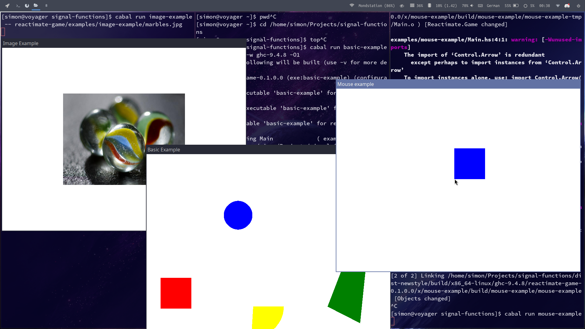

# Reactimate

`reactimate` is a library implementing the AFRP paradigm. In contrast to other libraries, `reactimate` uses `IO` effects to increase performance and a concrete base type to eliminate typeclass performance problems. In addition, `reactimate` has some support for pull-based FRP, making it possible to deal with events which happen in-between simulation cycles.

## Signal

The most important type is the `Signal`. A `Signal a b` represents a computation which uses `a` as input and produces `b` as output. `reactimate` implements a lot of combinators to work with those `Signal`s.

Here, we use the `arr` function from the `Arrow` typeclass to create a simple `Signal` from the `(+5)` function.
```haskell
add5 :: Signal Int Int
add5 = arr (+5)
```

We can easily execute signals in sequence with the `>>>` combinator.
```haskell
add10 :: Signal Int Int
add10 = add5 >>> add5
```

### Running signals

Typically, you will run `Signal`s with `reactimate`. It will run the given `Signal` over and over again until it finally produces a `Just` value and then returns that value.
```haskell
main :: IO ()
main = do
  result <- reactimate someSignal
  putStrLn result

someSignal :: Signal () (Maybe String)
someSignal = ...
```

With `reactimate`, it is easily possible to implement a game loop or some other simulation loop.

### Stateful signals

`Signal`s can store some internal state during their execution. In general, `Signal`s do **not** produce the same output for the same input!

State can be easily integreated in a `Signal` with the `feedback` function:
```haskell
feedback :: s -> Signal (a, s) (b, s) -> Signal a b

sum :: Signal Int Int
sum = feedback 0 $ arr \(input, acc) -> 
  let output = input + acc
  in (output, output)
```

`feedback` takes some initial state and then accumulates this state over simulations. The state from the last execution is fed back as input. The `sum` signal produces the sum of all its inputs by keeping track of the last output.

## Microbenchmarks

Beware that micro benchmarks may not reflect 1 to 1 on real applications. The actual performance gain on applications still needs to be tested.

```
Countdown benchmark/Yampa                mean 27.80 ms  ( +- 192.7 μs  )
Countdown benchmark/dunai                mean 70.35 ms  ( +- 261.6 μs  )
Countdown benchmark/reactimate           mean 388.0 μs  ( +- 409.2 ns  )

Integrate benchmark/Yampa                mean 98.37 ms  ( +- 229.2 μs  )
Integrate benchmark/reactimate           mean 9.719 ms  ( +- 45.72 μs  )

Chaining (>>>) benchmark/Yampa           mean 26.71 ms  ( +- 407.0 μs  )
Chaining (>>>) benchmark/dunai           mean 75.62 ms  ( +- 3.863 ms  )
Chaining (>>>) benchmark/reactimate      mean 3.703 ms  ( +- 61.67 μs  )
```

## Acknowledgements

Heavily inspired by [Yampa](https://github.com/ivanperez-keera/Yampa) and [dunai](https://github.com/ivanperez-keera/dunai).

# Reactimate Game

`reactimate-game` is a library for basic 2D games using `SDL`. [Take a look here](reactimate-game).


